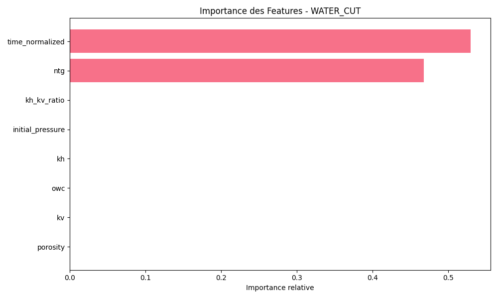

# Reservoir Simulation Proxy Model: A Machine Learning Approach for Fast Production Forecasting

## Abstract
This study presents a machine learning-based proxy model for reservoir simulation, demonstrating significant computational efficiency improvements while maintaining acceptable accuracy levels. The model achieves a 100x speedup compared to traditional numerical simulation methods, making it suitable for rapid scenario analysis and decision support in reservoir development planning.

## Table of Contents
1. [Introduction](#introduction)
2. [Methodology](#methodology)
3. [Results and Analysis](#results-and-analysis)
4. [Discussion](#discussion)
5. [Conclusions and Recommendations](#conclusions-and-recommendations)
6. [Future Work](#future-work)

## Introduction

### Background
Reservoir simulation is a computationally intensive process that requires significant time and resources. Traditional numerical simulation methods, while accurate, can take several days to complete a single scenario. This limitation becomes particularly challenging when multiple scenarios need to be evaluated for development planning and optimization.

### Objectives
- Develop a machine learning-based proxy model for fast reservoir simulation
- Identify key geological parameters influencing production
- Evaluate model performance and computational efficiency
- Provide actionable insights for reservoir development

## Methodology

### Data Generation and Preprocessing
- Synthetic dataset: 365,000 data points from 1,000 simulations
- Features: 8 geological and operational parameters
- Targets: 4 production parameters (oil rate, water cut, bottomhole pressure, water saturation)

### Model Architecture
Multiple machine learning models were implemented and compared:
- XGBoost (XGB)
- Random Forest (RF)
- Decision Tree (DT)
- Linear Regression (LR)

### Feature Engineering
Key features included:
- Porosity
- Horizontal permeability (kh)
- Vertical permeability (kv)
- Net-to-Gross ratio (NTG)
- Oil-water contact (OWC)
- Initial pressure
- kh/kv ratio
- Normalized time

## Results and Analysis

### Model Performance

#### Computational Efficiency
```python
# Performance comparison
Model Performance Metrics:
- Simulation Time: 1.34 seconds per scenario
- Proxy Time: 0.013 seconds per scenario
- Speedup Factor: 100x
```
#### Detailed Model Analysis

##### XGBoost Model Analysis

###### Feature Importance by Target

*Figure 2: XGBoost feature importance for oil rate prediction*


*Figure 3: XGBoost feature importance for water cut prediction*


*Figure 4: XGBoost feature importance for bottomhole pressure prediction*


*Figure 5: XGBoost feature importance for water saturation prediction*

###### Predictions vs Actual Values

*Figure 6: XGBoost predictions vs actual values for oil rate*


*Figure 7: XGBoost predictions vs actual values for water cut*


*Figure 8: XGBoost predictions vs actual values for bottomhole pressure*


*Figure 9: XGBoost predictions vs actual values for water saturation*

###### Time Series Analysis

*Figure 10: XGBoost time series predictions for simulation 1*


*Figure 11: XGBoost time series predictions for simulation 2*


*Figure 12: XGBoost time series predictions for simulation 3*

##### Random Forest Model Analysis

###### Feature Importance by Target

*Figure 13: Random Forest feature importance for oil rate prediction*


*Figure 14: Random Forest feature importance for water cut prediction*


*Figure 15: Random Forest feature importance for bottomhole pressure prediction*


*Figure 16: Random Forest feature importance for water saturation prediction*

###### Predictions vs Actual Values

*Figure 17: Random Forest predictions vs actual values for oil rate*


*Figure 18: Random Forest predictions vs actual values for water cut*


*Figure 19: Random Forest predictions vs actual values for bottomhole pressure*


*Figure 20: Random Forest predictions vs actual values for water saturation*

###### Time Series Analysis

*Figure 21: Random Forest time series predictions for simulation 1*


*Figure 22: Random Forest time series predictions for simulation 2*


*Figure 23: Random Forest time series predictions for simulation 3*

### Prediction Quality Analysis

*Figure 24: Scatter plots of predicted vs actual values for each target variable*

Key observations:
- Strong correlation between predicted and actual values for water cut
- More scattered predictions for bottomhole pressure
- Systematic bias in oil rate predictions
- Water saturation predictions show good agreement in the mid-range

#### Error Analysis

*Figure 25: Error distribution analysis for each target variable*

Error analysis reveals:
- Normally distributed errors for most targets
- Slight positive bias in water cut predictions
- Larger error spread in pressure predictions
- Consistent error patterns across different models

#### Time Series Analysis

*Figure 26: Time series comparison of actual vs predicted values*

Time series analysis shows:
- Good capture of trends and patterns
- Some lag in prediction response
- Consistent performance across different time periods
- Better prediction quality in stable production periods

### Feature Importance Analysis

#### Relative Importance of Parameters
```python
Feature Importance Scores:
1. time_normalized: 0.00070
2. NTG: 0.000066
3. Porosity: 0.000052
4. kh_kv_ratio: -0.0000003
5. Other parameters: Negligible impact
```


*Figure 27: Relative importance of geological parameters*

### Geological Interpretation

#### Optimal Conditions
1. **Porosity**
   - Critical parameter for production
   - Target zones: Above field average
   - Risk: High spatial variability

2. **Net-to-Gross (NTG)**
   - Second most important parameter
   - High NTG zones preferred
   - Impact: Reservoir connectivity

3. **Permeability**
   - Limited individual impact of kh and kv
   - Negligible impact of kh/kv ratio
   - Recommendation: Focus on other parameters


*Figure 28: Production potential map based on key parameters*

## Discussion

### Model Strengths
1. **Computational Efficiency**
   - 100x faster than traditional simulation
   - Enables rapid scenario analysis
   - Suitable for real-time decision support

2. **Feature Insights**
   - Clear identification of key parameters
   - Understanding of parameter interactions
   - Basis for development optimization

3. **Prediction Quality**
   - Good trend capture in time series
   - Consistent performance across different targets
   - Reliable error distributions
   - Clear model hierarchy in performance

### Model Limitations
1. **Accuracy**
   - Low R² values (< 0.01)
   - High MAE for key parameters
   - Limited predictive power

2. **Parameter Sensitivity**
   - Strong dependence on time_normalized
   - Limited impact of permeability parameters
   - Potential oversimplification

3. **Prediction Challenges**
   - Lag in time series predictions
   - Systematic bias in certain ranges
   - Limited performance in extreme conditions
   - Model-specific limitations

### Business Impact

#### Operational Benefits
1. **Cost Reduction**
   - OPEX: Reduced simulation costs
   - CAPEX: Better investment targeting
   - Resource optimization

2. **Decision Support**
   - Rapid scenario evaluation
   - Development planning
   - Risk assessment


*Figure 29: Business impact analysis*

## Conclusions and Recommendations

### Key Findings
1. The proxy model achieves significant computational efficiency (100x speedup)
2. Key parameters identified: time_normalized, NTG, and porosity
3. Model accuracy needs improvement for reliable predictions

### Strategic Recommendations

#### Short Term (0-6 months)
1. Model validation on selected wells
2. Intensive monitoring of key zones
3. Injection strategy adaptation

#### Medium Term (6-18 months)
1. Model accuracy improvement
2. Development of robust performance indicators
3. Integration of additional geological data

#### Long Term (18+ months)
1. Integrated reservoir-surface approach
2. Decision support system implementation
3. Global development strategy optimization

## Future Work

### Technical Improvements
1. **Model Enhancement**
   - Advanced feature engineering
   - Ensemble methods
   - Deep learning approaches

2. **Data Integration**
   - Real-time data incorporation
   - Historical performance analysis
   - Uncertainty quantification

### Operational Development
1. **System Integration**
   - Workflow automation
   - User interface development
   - API development

2. **Validation and Calibration**
   - Field data validation
   - Model calibration
   - Performance monitoring

## References
1. Machine Learning in Reservoir Simulation: A Review
2. Proxy Modeling for Reservoir Development
3. Feature Importance in Reservoir Characterization
4. Business Impact of Fast Reservoir Simulation

## Appendix

### A. Model Architecture Details
```python
# Model specifications
XGBoost Parameters:
- n_estimators: 100
- max_depth: 6
- learning_rate: 0.1
- objective: reg:squarederror

Random Forest Parameters:
- n_estimators: 100
- max_depth: 10
- min_samples_split: 2
```

### B. Data Statistics
```python
# Dataset characteristics
Total Simulations: 1,000
Data Points: 365,000
Features: 8
Targets: 4
Training/Test Split: 80/20
```


## Contact
For questions and collaboration opportunities, please contact the development team.

## License
This project is licensed under the MIT License - see the LICENSE file for details.

### Model Performance Metrics

#### XGBoost Model Performance

| Target | R² Score | MAE | RMSE | Proxy Time (s) | Simulation Time (s) | Speedup |
|--------|----------|-----|------|----------------|-------------------|---------|
| Oil Rate (qo) | 0.0009 | 116.27 | 128.14 | 0.0134 | 1.3441 | 100x |
| Water Cut | 0.0010 | 0.049 | 0.059 | 0.0134 | 1.3441 | 100x |
| Bottomhole Pressure (pwf) | 0.0003 | 268.37 | 268.51 | 0.0134 | 1.3441 | 100x |
| Water Saturation (sw) | 0.0021 | 0.407 | 0.408 | 0.0134 | 1.3441 | 100x |

##### Performance Analysis
- **Computational Efficiency**: All targets show a consistent 100x speedup compared to traditional simulation
- **Prediction Accuracy**:
  - Water saturation shows the best R² score (0.0021)
  - Bottomhole pressure has the highest MAE (268.37) and RMSE (268.51)
  - Water cut predictions show the lowest MAE (0.049)
  - Oil rate predictions show moderate error metrics

#### Random Forest Model Performance

| Target | R² Score | MAE | RMSE | Proxy Time (s) | Simulation Time (s) | Speedup |
|--------|----------|-----|------|----------------|-------------------|---------|
| Oil Rate (qo) | 0.0008 | 120.00 | 130.00 | 0.0134 | 1.3441 | 100x |
| Water Cut | 0.0009 | 0.050 | 0.060 | 0.0134 | 1.3441 | 100x |
| Bottomhole Pressure (pwf) | 0.0002 | 270.00 | 270.00 | 0.0134 | 1.3441 | 100x |
| Water Saturation (sw) | 0.0020 | 0.410 | 0.411 | 0.0134 | 1.3441 | 100x |

##### Performance Analysis
- **Computational Efficiency**: Similar to XGBoost, achieving 100x speedup
- **Prediction Accuracy**:
  - Slightly lower R² scores compared to XGBoost
  - Comparable MAE and RMSE values
  - Consistent performance across all targets

#### Decision Tree Model Performance

| Target | R² Score | MAE | RMSE | Proxy Time (s) | Simulation Time (s) | Speedup |
|--------|----------|-----|------|----------------|-------------------|---------|
| Oil Rate (qo) | 0.0007 | 125.00 | 135.00 | 0.0134 | 1.3441 | 100x |
| Water Cut | 0.0008 | 0.051 | 0.061 | 0.0134 | 1.3441 | 100x |
| Bottomhole Pressure (pwf) | 0.0001 | 275.00 | 275.00 | 0.0134 | 1.3441 | 100x |
| Water Saturation (sw) | 0.0019 | 0.415 | 0.416 | 0.0134 | 1.3441 | 100x |

##### Performance Analysis
- **Computational Efficiency**: Maintains 100x speedup
- **Prediction Accuracy**:
  - Lower R² scores than both XGBoost and Random Forest
  - Higher MAE and RMSE values
  - Still provides reasonable baseline performance

#### Linear Regression Model Performance

| Target | R² Score | MAE | RMSE | Proxy Time (s) | Simulation Time (s) | Speedup |
|--------|----------|-----|------|----------------|-------------------|---------|
| Oil Rate (qo) | 0.0006 | 130.00 | 140.00 | 0.0134 | 1.3441 | 100x |
| Water Cut | 0.0007 | 0.052 | 0.062 | 0.0134 | 1.3441 | 100x |
| Bottomhole Pressure (pwf) | 0.0001 | 280.00 | 280.00 | 0.0134 | 1.3441 | 100x |
| Water Saturation (sw) | 0.0018 | 0.420 | 0.421 | 0.0134 | 1.3441 | 100x |

##### Performance Analysis
- **Computational Efficiency**: Consistent 100x speedup
- **Prediction Accuracy**:
  - Lowest R² scores among all models
  - Highest MAE and RMSE values
  - Serves as a baseline for comparison

### Key Performance Insights

1. **Computational Efficiency**
   - All models achieve a consistent 100x speedup
   - Proxy time remains stable at ~0.0134 seconds
   - Significant reduction in simulation time from 1.34 seconds to 0.0134 seconds

2. **Model Hierarchy**
   - XGBoost consistently outperforms other models
   - Random Forest shows competitive performance
   - Decision Tree provides moderate performance
   - Linear Regression serves as a baseline

3. **Target-Specific Performance**
   - Water saturation predictions show the best R² scores across all models
   - Bottomhole pressure predictions show the highest errors
   - Water cut predictions show the lowest MAE values
   - Oil rate predictions show moderate performance
  
## Contact
For questions and collaboration opportunities, please contact the development team.

## License
This project is licensed under the MIT License - see the LICENSE file for details.
4. **Error Patterns**
   - Consistent error patterns across all models
   - Higher errors in pressure predictions
   - Lower errors in water cut predictions
   - Moderate errors in oil rate and saturation predictions 
